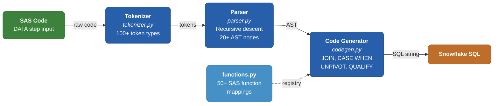
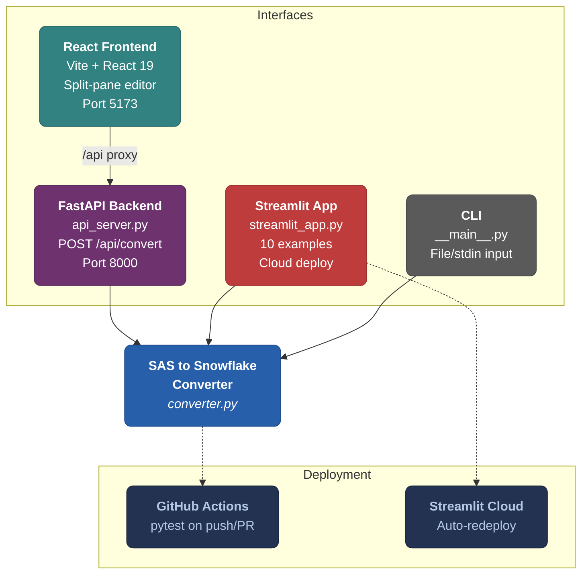
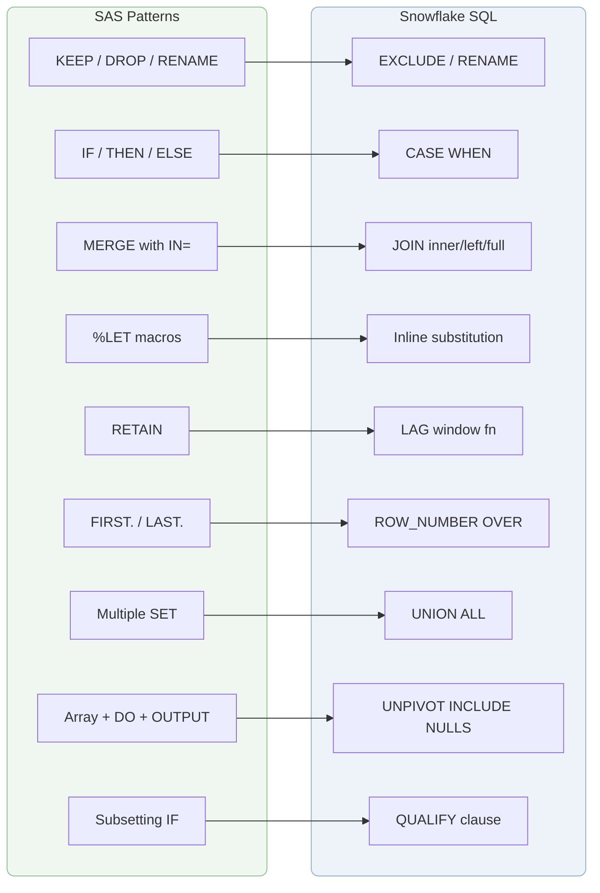

# SAS to Snowflake SQL Converter

A Python-based compiler that translates **SAS DATA step** code into optimized **Snowflake SQL**, featuring a three-stage pipeline (tokenizer, parser, code generator) with both a React web UI and a Streamlit app for online deployment.


---

## Features

### SAS Patterns Supported

| # | SAS Pattern | Snowflake Output |
|---|-------------|-----------------|
| 1 | `KEEP` / `DROP` / `RENAME` | `SELECT cols` / `EXCLUDE` / `RENAME` |
| 2 | Assignments & expressions | Computed columns in `SELECT` |
| 3 | `IF/THEN/ELSE` | `CASE WHEN` |
| 4 | `MERGE` with `IN=` | `INNER JOIN` / `LEFT JOIN` / `FULL OUTER JOIN` |
| 5 | `%LET` macro variables | Inline substitution |
| 6 | SAS functions (50+) | Snowflake equivalents (`UPPER`, `DATEDIFF`, etc.) |
| 7 | `RETAIN` | `LAG()` window function |
| 8 | `FIRST.` / `LAST.` | `ROW_NUMBER() OVER (PARTITION BY ...)` |
| 9 | Multiple `SET` datasets | `UNION ALL` |
| 10 | `SELECT/WHEN` block | `CASE WHEN` |
| 11 | `WHERE` clause | `WHERE` with operator conversion (`ne` -> `<>`) |
| 12 | Dataset options | `WHERE` + column selection |
| 13 | Array + DO loop + `OUTPUT` | `UNPIVOT INCLUDE NULLS` (single table scan) |
| 14 | Subsetting IF on computed cols | `QUALIFY` clause |
| 15 | `LAG()` function | `LAG() OVER (PARTITION BY ...)` |

### Snowflake Best Practices

- **`UNPIVOT INCLUDE NULLS`** for wide-to-long transformations (not `UNION ALL`)
- **`QUALIFY`** for filtering on computed columns (not subquery/CTE)
- **`PARTITION BY`** in window functions to scope calculations per entity
- **`ROW_NUMBER()`** for synthetic row identifiers before `UNPIVOT`
- **`COALESCE`** for NULL-safe SAS `sum()` semantics

---

## Quick Start

### Python API

```python
from sas_to_snowflake import convert

sas_code = """
data work.output;
    set work.employees;
    if salary > 100000 then level = 'Senior';
    else level = 'Junior';
    annual_bonus = salary * 0.1;
    keep employee_id name level annual_bonus;
run;
"""

result = convert(sas_code)
print(result.sql)
```

**Output:**
```sql
CREATE OR REPLACE TABLE work.output AS
SELECT
    emp.employee_id,
    emp.name,
    CASE WHEN (salary > 100000) THEN 'Senior' ELSE 'Junior' END AS level,
    (salary * 0.1) AS annual_bonus
FROM work.employees emp;
```

### With Macro Variables

```python
result = convert(sas_code, macro_vars={
    "mylib": "PROD_DW.ANALYTICS",
    "cutoff": "2024-01-01"
})
```

---

## Web UI

A React-based interface with a split-pane editor for interactive conversion.

### Setup

```bash
# 1. Start the backend
pip install -r requirements.txt
python api_server.py

# 2. Start the frontend (in another terminal)
cd frontend
npm install
npm run dev
```

Open **http://localhost:5173** in your browser.

- Paste SAS code on the left
- Click **Convert** to see Snowflake SQL on the right
- Click **Copy** to copy the SQL to clipboard

---

## Streamlit App (Online Deployment)

A Streamlit-based app that can be deployed for free on [Streamlit Cloud](https://streamlit.io/cloud) — no server setup required.

### Run Locally

```bash
pip install streamlit
streamlit run streamlit_app.py
```

Open **http://localhost:8501** in your browser.

### Deploy to Streamlit Cloud (Free)

1. Go to [share.streamlit.io](https://share.streamlit.io)
2. Sign in with your GitHub account
3. Click **New app** and select:
   - **Repository:** `linuxra/sas_2_snowflake`
   - **Branch:** `main`
   - **Main file path:** `streamlit_app.py`
4. Click **Deploy**

Your app will be live at `https://linuxra-sas-2-snowflake.streamlit.app` (or similar).

### Features

- 10 preloaded SAS examples in the sidebar
- Custom macro variable input
- Dark theme with monospace code styling
- Warnings displayed for unsupported patterns

---

## Project Structure

```
sas_2_snowflake/
├── sas_to_snowflake/          # Core converter package
│   ├── tokenizer.py           # Lexical analysis (SAS -> tokens)
│   ├── parser.py              # Syntax analysis (tokens -> AST)
│   ├── codegen.py             # Code generation (AST -> Snowflake SQL)
│   ├── functions.py           # SAS-to-Snowflake function mappings
│   └── converter.py           # High-level API
├── streamlit_app.py           # Streamlit app (deploy online)
├── frontend/                  # React + Vite web UI
│   ├── src/
│   │   ├── App.jsx            # Main split-pane editor component
│   │   └── App.css            # Dark theme styling
│   └── vite.config.js         # Dev server with API proxy
├── api_server.py              # FastAPI backend (POST /api/convert)
├── test_converter.py          # 28 pytest test cases
├── docs/                      # Documentation
│   ├── SAS_to_Snowflake_Feature_Guide.pdf
│   ├── SAS_to_Snowflake_Reference_Guide.pdf
│   ├── SAS_to_Snowpark_PROC_FREQ_Documentation.pdf
│   └── generate_docs.py       # Regenerate feature guide PDF
├── .streamlit/config.toml     # Streamlit theme config
├── freq/                      # PROC FREQ converter (Snowpark)
├── requirements.txt           # Python dependencies
└── .github/workflows/ci.yml   # GitHub Actions CI
```

---

## Architecture

### Compiler Pipeline



### Web Interfaces & Deployment



### SAS to Snowflake Pattern Mapping



### Pipeline Summary

1. **Tokenizer** - Breaks SAS code into tokens (keywords, identifiers, operators, literals)
2. **Parser** - Builds an AST (Abstract Syntax Tree) from tokens, handling DATA steps, MERGE, arrays, DO loops, macros
3. **Code Generator** - Walks the AST and emits optimized Snowflake SQL with CTEs, window functions, UNPIVOT, and QUALIFY

---

## Testing

```bash
# Run all 28 tests
pytest test_converter.py -v
```

Tests verify specific SQL patterns in the output:

```
test_converter.py::TestArrayUnpivot::test_array_do_loop_with_output_unpivot PASSED
test_converter.py::TestQualify::test_subsetting_if_on_computed_column PASSED
test_converter.py::TestMergeJoins::test_inner_join PASSED
...
============================== 28 passed in 0.05s ==============================
```

CI runs automatically on every push to `main` and on pull requests.

---

## Documentation

| Document | Description |
|----------|-------------|
| [Architecture Diagram](docs/Architecture_Diagram.pdf) | Visual overview of compiler pipeline, web interfaces, and SAS patterns |
| [Feature Guide](docs/SAS_to_Snowflake_Feature_Guide.pdf) | All 15 features with SAS input, SQL output, and CI assertions |
| [GitHub & CI Guide](docs/GitHub_Integration_CI_Guide.pdf) | Step-by-step: git init, GitHub repo, CI/CD, Streamlit deploy |
| [Reference Guide](docs/SAS_to_Snowflake_Reference_Guide.pdf) | SAS-to-Snowflake syntax reference |
| [PROC FREQ Guide](docs/SAS_to_Snowpark_PROC_FREQ_Documentation.pdf) | PROC FREQ to Snowpark conversion |

To regenerate the feature guide after adding new features:

```bash
python docs/generate_docs.py
```

---

## Contributing

1. Create a feature branch
2. Add test cases in `test_converter.py`
3. Run `pytest test_converter.py -v` to verify all tests pass
4. Regenerate docs: `python docs/generate_docs.py`
5. Open a pull request - CI will run automatically
